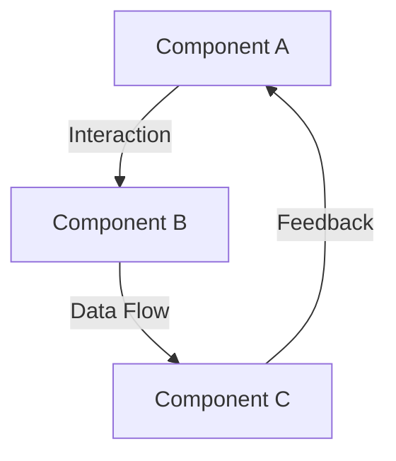
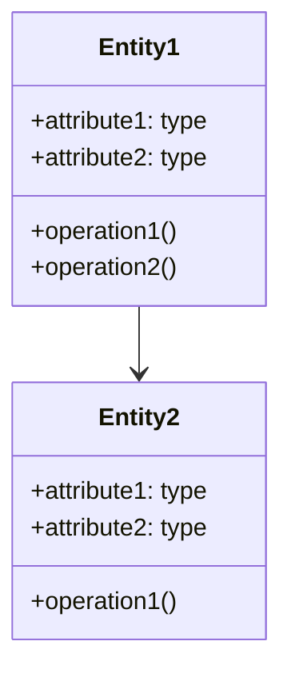
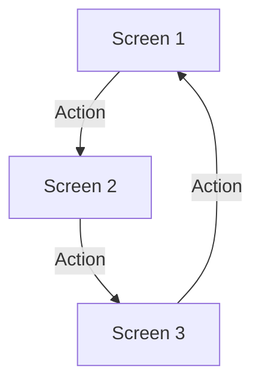

# Specification: {Feature/Module Name}

## Overview

Brief description of the feature or module being specified.

## Goals

- Primary goal of this feature/module
- Secondary goals
- Success criteria

## Requirements

### Functional Requirements

1. **{Requirement Category}**
   - Requirement 1
   - Requirement 2
   - Requirement 3

2. **{Another Requirement Category}**
   - Requirement 1
   - Requirement 2

### Non-Functional Requirements

1. **Performance**
   - Performance requirement 1
   - Performance requirement 2

2. **Security**
   - Security requirement 1
   - Security requirement 2

3. **Usability**
   - Usability requirement 1
   - Usability requirement 2

## Architecture



### Components

1. **Component A**
   - Purpose
   - Responsibilities
   - Interfaces

2. **Component B**
   - Purpose
   - Responsibilities
   - Interfaces

3. **Component C**
   - Purpose
   - Responsibilities
   - Interfaces

## Data Model



## Workflows

### Primary Workflow

```mermaid
sequenceDiagram
    Actor->>System: Action
    System->>Database: Query
    Database-->>System: Response
    System-->>Actor: Result
```

### Secondary Workflow

```mermaid
sequenceDiagram
    Actor->>System: Alternative Action
    System->>Service: Request
    Service-->>System: Response
    System-->>Actor: Alternative Result
```

## Interfaces

### API Endpoints

| Endpoint | Method | Description | Request | Response |
|----------|--------|-------------|---------|----------|
| `/path1` | GET    | Description | N/A     | Schema   |
| `/path2` | POST   | Description | Schema  | Schema   |

### User Interfaces



## Constraints and Limitations

- Constraint 1
- Constraint 2
- Limitation 1

## Dependencies

- Dependency 1
- Dependency 2

## Testing Strategy

- Unit testing approach
- Integration testing approach
- End-to-end testing approach

## Open Questions

- Question 1
- Question 2
